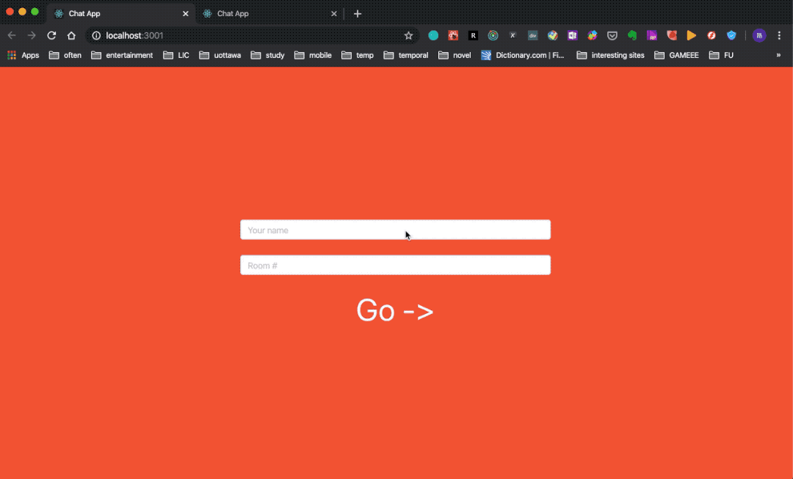

This is a practice project of a chat app. It uses by ```Ruby on Rails``` and ReactJS. The backend was implemented using Action Cable of Ruby on Rails and Redis. The frontend was implemented using ReactJS and Redux.

### Screen Recording



### Environments

* Ruby: 2.6.3p62
* Ruby on Rails: 6.0.2.1
* Redis: 5.0.7
* node: 8.17.0
* ReactJS: 16.12.0

### Try the project

1. In the folder /server, run ```bundle install``` to install the dependencies (assume you have Ruby and Redis installed).
2. In the folder /client, run ```npm install``` to install the dependencies (assume you have node installed).
3. In the folder /server, run ```rails s``` to start the backend server.
4. In the folder /client, run ```npm start``` to start the frontend server.
